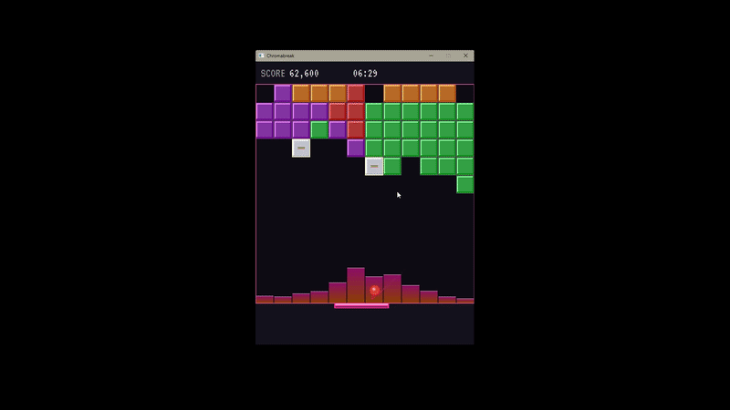

# ChromaBreak

<div align="center">
  
</div>
<div align="center">
  <p>
    <em>Where classic Arkanoid meets modern rhythm and light. </em>
  </p>
  
  
  
  

</div>

## Overview

ChromaBreak is a vibrant, audio-reactive arcade experience that draws elements from classics
like Arkanoid (Breakout), Tetris, and Candy Crush. It synergizes retro brick-breaking with modern
signal processing and procedurally generated game entities.

### Key Features

- **Real-time Audio Visualization** - Uses Goertzel's algorithm and RMS for efficient digital signal processing, and smooth frequency-domain transformations.
- **Color-matching Brick Destruction** - Dynamic destruction of adjacent color-grouped bricks using a BFS floodfill for a Candy Crush / Tetris-like experience.
- **Custom Visual FX System** - In-house Particle and Rendering System that manages the lifetime and drawing of individual particle effects and sprites.
- **Procedurally Generated Map** - Fine-tuned randomized generation of brick variants and intelligent row-spawning with selective vertical shifting of contiguous brick segments.
- **Self-made Music** - 2/3 soundtracks (Forsaken One and Neon Twillight) were composed by me, [check them out on SoundCloud](https://on.soundcloud.com/9b8rrfLvJLcgtKwdrL)!


### Main Objective

The player controls a hover pad used to bounce a colored-ball in order to break bricks
to ascertain a higher score while staying alive as long as possible.

This is achieved by preventing bricks from filling into the player region, and avoiding misdirection of the ball
flying below the game window.

### Controls

<div>
  <table>
    <tr>
      <th align="center">Control</th>
      <th align="center">Effect</th>
    </tr>
    <tr>
      <td align="center"><code>Q</code></td>
      <td align="center">🔴</td>
    </tr>
    <tr>
      <td align="center"><code>W</code></td>
      <td align="center">🔵</td>
    </tr>
    <tr>
      <td align="center"><code>E</code></td>
      <td align="center">🟢</td>
    </tr>
    <tr>
      <td align="center"><code>A</code></td>
      <td align="center">🟡</td>
    </tr>
    <tr>
      <td align="center"><code>S</code></td>
      <td align="center">🟠</td>
    </tr>
    <tr>
      <td align="center"><code>D</code></td>
      <td align="center">🟣</td>
    </tr>
    <tr>
      <td align="center"><code>SPACEBAR</code></td>
      <td align="center">Cycle through ball colors</td>
    </tr>
	<tr>
      <td align="center"><code>ARROW KEYS (←↑↓→)</code></td>
      <td align="center">NSEW movement of the hover pad</td>
    </tr>
	<tr>
      <td align="center"><code>R</code></td>
      <td align="center">Restart upon game over</td>
    </tr>
  </table>
</div>

### Brick Variants

Upon destruction, a single brick rewards **100 points**. Normal, colored bricks
**must be broken by a specific color** while special bricks are breakable by **any color**.

- **Normal Brick** - Colored red through purple and only breakable by specific color.
- **Bomb Brick (Special)** - Blows up all bricks within a 2x2 radius regardless of color.
- **Transformer Brick (Special)** - Transforms all bricks within a 4x4 radius to it's specific color.
- **Rainbow Brick (Special)** - Temporarily grants the player a rainbow ball that breaks any colored bricks.
- **Reverser Brick (Special)** - Temporarily reverses the direction of brick-shifting from top-bottom to bottom-up, destroying bricks pushed to the very top. Also prevents new bricks from spawning.


## Installation

### Prerequisites

- **Windows** (x64)
- **Visual Studio 2022** with the *Desktop development with C++* workload

All SDL2 dependencies (SDL2, SDL2_ttf, SDL2_mixer) are bundled — no separate installation required.

### Steps

1. **Clone the repository**
   ```
   git clone https://github.com/your-username/Chromabreak.git
   cd Chromabreak
   ```

2. **Open the solution**

   Double-click `Chromabreak.sln`, or open it from Visual Studio via *File → Open → Project/Solution*.

3. **Select the build configuration**

   In the toolbar, set the configuration to **Release** and platform to **x64**.

   > Win32 builds are not supported — the bundled SDL2 binaries are x64 only.

4. **Build and run**

   Press `Ctrl+Shift+B` to build, then `F5` (or `Ctrl+F5`) to run.

   The compiled executable and all required DLLs will be placed in `x64/Release/`.

## License

This project is licensed under the MIT License - see the [LICENSE](LICENSE) file for details.

## References

- [SDL2 Official Wiki](https://wiki.libsdl.org/SDL2/FrontPage)
- [SDL_Mixer 2.0 Wiki](https://wiki.libsdl.org/SDL2_mixer/FrontPage)
- [SDL_TTF 2.0 Wiki](https://wiki.libsdl.org/SDL2_ttf/FrontPage)
- Thank you Ephixa & Laura Brehm for the 3rd soundtrack, [Losing You](https://www.youtube.com/watch?v=9vN534jMCUU) (please don't sue me I haven't got much)
- SFX was curated from [Kingdom Hearts III](https://www.youtube.com/watch?v=0aMlm7rWY3I&pp=ygUSa2luZ2RvbSBoZWFydHMgc2Z4) (please don't be litigious Disney, again I don't have anything) 
